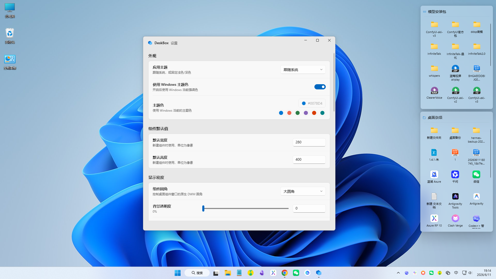
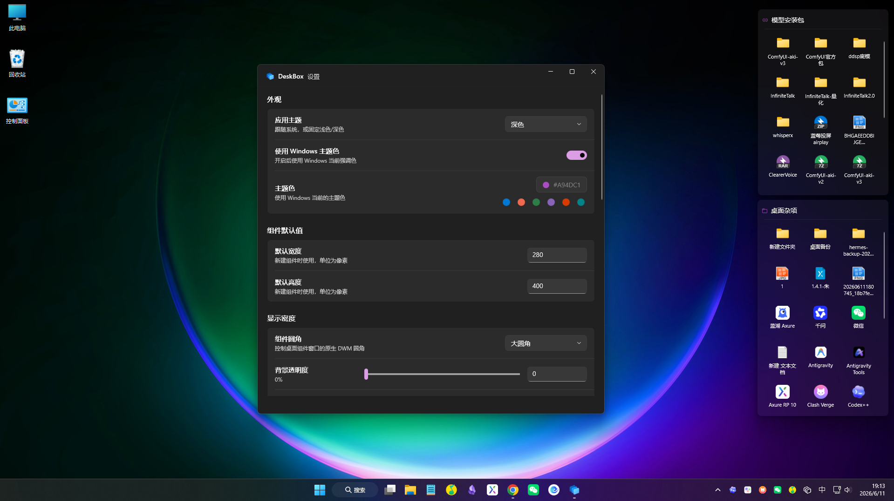
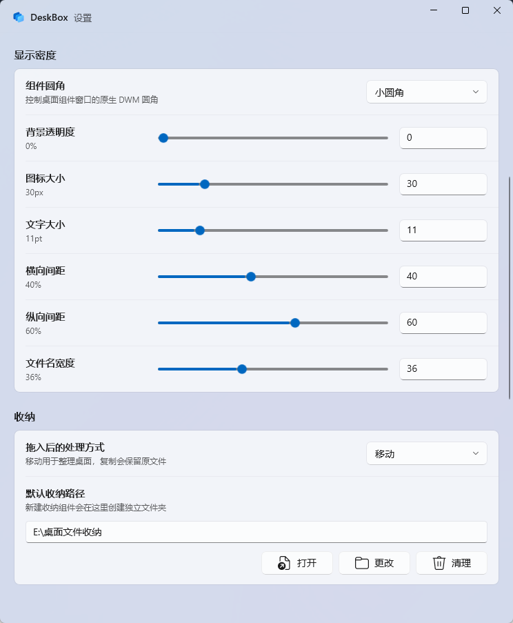
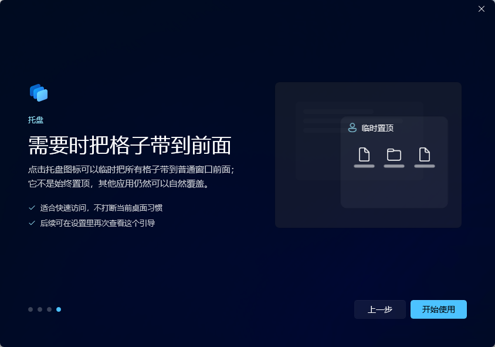

# DeskBox

[中文](README.md) | English

[](https://github.com/Tianyu199509/DeskBox/actions/workflows/ci.yml)
[](LICENSE)
[](#requirements)
[](#build)

DeskBox is a lightweight WinUI 3 desktop organizer for Windows 11. It lets you create native-feeling desktop widgets for collecting files, mapping folders, and temporarily bringing your desktop groups forward from the tray without replacing the Windows desktop shell.



## Download

Download the latest installer from [GitHub Releases](https://github.com/Tianyu199509/DeskBox/releases).

Current release:

- [DeskBox_Setup_1.0.3_x64.exe](https://github.com/Tianyu199509/DeskBox/releases/download/v1.0.3/DeskBox_Setup_1.0.3_x64.exe)

The installer checks for .NET 8 Runtime x64 and Windows App Runtime 2.1.3 x64. If either dependency is missing, the setup flow can download and install it for you.

## What's New In 1.0.3

- Added widget show/hide animation effect and speed settings, including slide, fade, scale fade, and no-animation options.
- Improved the animation pipeline to reduce acrylic surface flicker, black backing, and duplicated icon motion.
- Improved tray left-click behavior so widgets hidden behind other windows are raised first, then hidden on the next click.
- Improved the tray Settings command so the Settings window opens temporarily on top and returns to normal layering after focus leaves.
- Improved temporary foreground behavior for new widgets, widget dragging, and native folder picker flows.
- Added performance logging support to help diagnose future stutter and startup timing issues.

See the full [changelog](CHANGELOG.md).

## Why DeskBox Exists

Many desktop organization tools take over the desktop: they replace familiar interactions, rebuild file entry points, or become a second desktop shell. DeskBox takes a narrower approach. The Windows desktop stays the Windows desktop, and your files stay normal files. DeskBox only adds a clean layer for moving, copying, grouping, and viewing those files.

The product is intentionally built around native Windows behavior. Widgets use WinUI 3, Windows App SDK, DWM corners, acrylic-style surfaces, and a tray-first workflow so the app feels like it belongs on Windows 11 instead of sitting on top of it.

## Features

- **Managed desktop widgets**: create file collection widgets backed by a real folder.
- **Folder mapping**: display an existing folder as a desktop widget without moving its contents.
- **Move or copy on drop**: choose whether managed widgets organize by moving files or by keeping originals and adding copies.
- **Tray controls**: create widgets, map folders, show or hide all widgets, temporarily raise widgets, open Settings, toggle startup launch, and exit.
- **Native file operations**: drag in, drag out, paste, cut, rename, delete, open, reveal in Explorer, and use keyboard shortcuts.
- **Appearance controls**: tune theme, opacity, DWM corner style, icon size, text size, spacing, filename width, and list details.
- **Safe cleanup prompts**: make widget deletion and managed-folder cleanup explicit so user files are not removed unexpectedly.
- **First-run onboarding**: configure important defaults before using the app, then replay onboarding from Settings when needed.

## Screenshots

### Desktop Widgets



### Settings



### Onboarding



## Requirements

- Windows 11.
- .NET 8 Runtime x64.
- Windows App Runtime 2.1.3 x64.

DeskBox is currently tested on Windows 11. Windows 10 may work in some environments, but it is not a validated target.

For development, install the .NET 8 SDK. Visual Studio 2022 with Windows App SDK workload is recommended.

## Install And Uninstall

The installer is built with Inno Setup. It preserves existing app settings, widget configuration, and managed storage content during overwrite installs.

Startup launch is handled silently through the tray. If DeskBox is already running and Windows starts it again at login, the second startup instance exits without opening Settings.

During uninstall, DeskBox stops the running app first. Managed storage content is not deleted silently; when cleanup may affect user files, the installer asks before removing anything.

## Build

Restore and build:

```powershell
dotnet restore .\DeskBox.sln -p:Platform=x64 -p:RuntimeIdentifier=win-x64
dotnet build .\src\DeskBox\DeskBox.csproj --configuration Debug --no-restore -p:Platform=x64 -p:RuntimeIdentifier=win-x64 -v:minimal
```

Run tests:

```powershell
dotnet test .\DeskBox.sln --configuration Debug --no-restore -p:Platform=x64 -p:RuntimeIdentifier=win-x64 -v:minimal
```

Create a Release x64 publish output and installer:

```powershell
dotnet publish .\src\DeskBox\DeskBox.csproj --configuration Release -p:Platform=x64 -p:RuntimeIdentifier=win-x64 -p:SelfContained=false -p:WindowsAppSDKSelfContained=false -o .\artifacts\publish\DeskBox\x64 -v:minimal
& 'C:\Program Files\Inno Setup 7\ISCC.exe' .\installer\DeskBox.iss
```

Installer output:

```text
Output\DeskBox_Setup_1.0.3_x64.exe
```

## Project Structure

```text
src\DeskBox                 WinUI 3 app source
tests\DeskBox.Tests         core service tests
installer                   Inno Setup scripts
docs\images                 README and release images
```

## Data Locations

- Settings are stored under `%LocalAppData%\DeskBox\data`.
- The default managed storage root is `%UserProfile%\DeskBox`.
- Generated folders such as `bin`, `obj`, `Output`, `artifacts`, and `TestResults` are ignored by Git.

## Feedback

DeskBox is still an early public release. If you hit file drag/drop issues, runtime dependency problems, window layering bugs, uninstall edge cases, or Windows-version compatibility problems, please open an [issue](https://github.com/Tianyu199509/DeskBox/issues) with reproduction details.

## Author

- Developer: Tianyu Zhu
- Repository: <https://github.com/Tianyu199509/DeskBox>

## License

DeskBox is released under the [MIT License](LICENSE).
