# DeskBox

English | [简体中文](README.zh-CN.md)

[](https://github.com/Tianyu199509/DeskBox/actions/workflows/ci.yml)
[](LICENSE)
[](#requirements)
[](#build)

DeskBox is a lightweight WinUI 3 desktop organizer for Windows 11. It creates native-feeling desktop widgets for collecting files, mapping folders, keeping todos, capturing quick notes, and controlling music from the desktop. It does not replace the Windows desktop shell; it adds one focused layer for keeping everyday things easier to reach, easier to sort, and easier to bring forward when you need them.

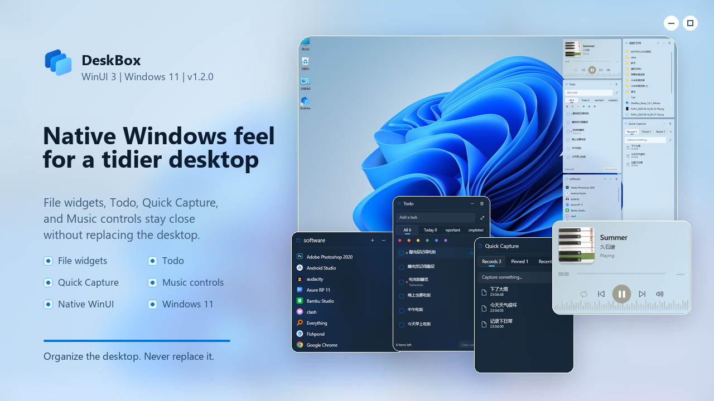

## Download

Download the latest installer from [GitHub Releases](https://github.com/Tianyu199509/DeskBox/releases).

Current release: 1.3.0

- [DeskBox_Setup_1.3.0_x64.exe](https://github.com/Tianyu199509/DeskBox/releases/download/v1.3.0/DeskBox_Setup_1.3.0_x64.exe)

The installer checks for .NET 10 Runtime x64 and Windows App Runtime 2.2 x64. If either dependency is missing, the setup flow can download and install it for you.

## What's New In 1.3.0

- **Capsule mode**: Collapse widgets into compact, information-rich surfaces. Expand by click or title-area hover, choose smart/summary/minimal content, hide sensitive text, and keep compact and expanded widths aligned or independent.
- **Flexible capsule layouts**: Position capsules freely or combine them into an ordered movable bar with floating or edge placement, automatic direction and adjustable spacing. Screen-aware anchors keep expansion and collapse connected to the compact position.
- **Automatic file stacks**: Group file-widget items by type or date without moving files, or create prioritized custom extension rules with live previews, thresholds, sorting and an unmatched-file policy.
- **Todo and Quick Capture attachments**: Associate multiple files, link originals or copy them into DeskBox, include localized paths when copying content, configure visible tabs, drag entries onto tabs, and tune preview lines and Enter-key behavior.
- **Appearance and Music controls**: Added Mica Alt, Base acrylic, material intensity, border color modes and display-density presets. Music can adapt automatically or force Cover/Controls mode.
- **Windows-style Settings**: Title-bar search, focused detail pages, clearer hierarchy and important options directly on entry cards make advanced configuration easier to discover without crowding the main pages.
- **Data safety**: Export and restore integrity-checked backups, manage automatic snapshots, recover resilient JSON stores and scan Todo/Quick Capture attachment health.
- **Interaction reliability**: Improved capsule/stack transitions, drag-to-expand, title-bar actions, resize guides, Z-order, tray show/hide, multi-monitor bounds restoration and rapid repeated interactions.

See the full [changelog](CHANGELOG.md).

## Why DeskBox Exists

The Windows desktop has been one of the most-used places on the PC for decades, but for many people it also becomes the easiest place to make a mess. DeskBox exists to keep that familiar desktop useful without turning it into something else. Your desktop stays the Windows desktop, and your files stay normal files; DeskBox simply gives you small, tidy places to collect, map, search, edit, and bring things forward.

The project is intentionally built around native Windows behavior. I like the texture and restraint of WinUI, so DeskBox will keep following native Windows patterns wherever practical: WinUI 3 controls, Windows App SDK, DWM corners, acrylic-style surfaces, tray-first behavior, and conservative dependencies. The installer stays framework-dependent: it checks .NET and Windows App Runtime on the target PC and downloads only a missing dependency.

## Features

- **Managed desktop widgets**: create file collection widgets backed by a real folder.
- **Folder mapping**: display an existing folder as a desktop widget without moving its contents.
- **Todo widget**: keep desktop tasks with due dates, reminders, recurrence, color markers, multiple attachments, configurable views and batch actions.
- **Quick Capture**: keep reusable text, links, images and files with pinning, paper styles, multiple attachments and focused detail editing.
- **Music widget**: control playback, switch playback mode, adjust system volume, and use responsive album-art layouts with optional album-color ambience.
- **Capsule mode**: collapse widgets into compact smart summaries, place them independently or combine them into an ordered desktop bar.
- **Automatic file stacks**: group related file-widget items by type, date or prioritized custom extension rules without moving the actual files.
- **Copy into managed storage**: dropped files are copied into the managed widget's real storage folder by default; move remains available in Settings.
- **Tray controls**: create widgets, map folders, show or hide all widgets, temporarily raise widgets, open managed storage, open Settings, toggle startup launch, and exit.
- **Global hotkey**: enable a keyboard shortcut for quickly showing, hiding, or raising widgets.
- **Native file operations**: drag in, drag out, paste, cut, rename, delete, open, reveal in Explorer, use keyboard shortcuts, and preview through a running QuickLook instance with Space.
- **Appearance controls**: tune native material, intensity, opacity, border color/style, DWM corners, display density, icon/text size, title style and cover ambience.
- **Data and storage maintenance**: export or restore backups, inspect automatic snapshots and attachment health, change the managed storage root, pin it to Quick Access, and recover orphan folders.

## Screenshots

DeskBox includes both English and Chinese localization. The screenshots below highlight the Windows 11-style desktop widgets, feature widgets, and Settings.

### Desktop Overview

| Light theme | Dark theme |
| --- | --- |
| 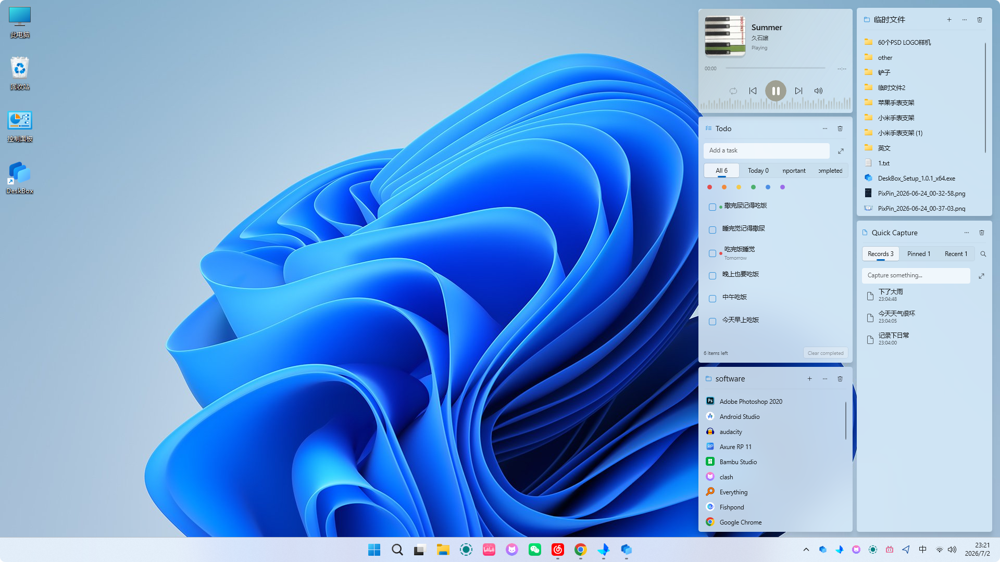 | 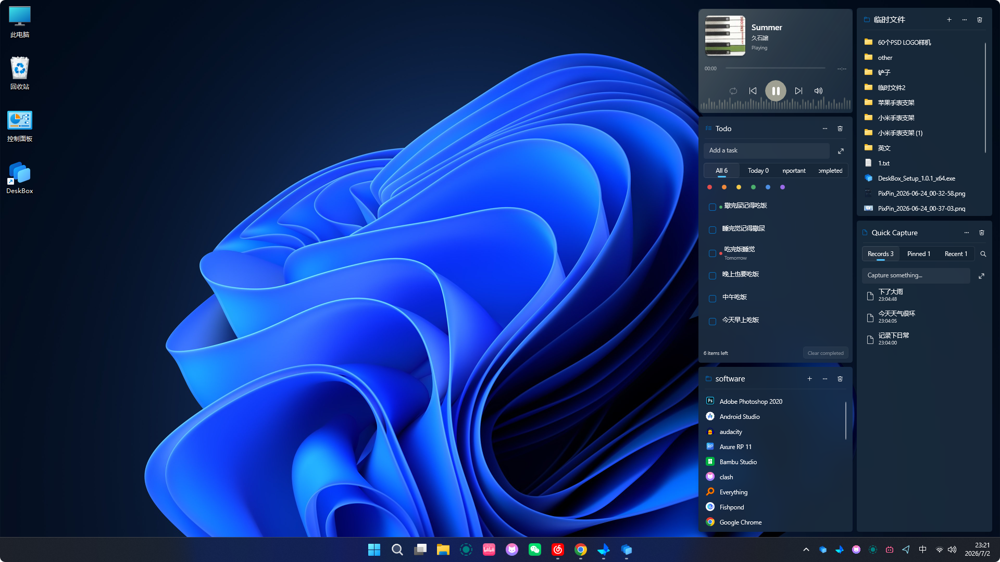 |

### Core Widgets

| File widget | Todo widget |
| --- | --- |
| 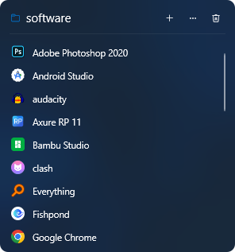 | 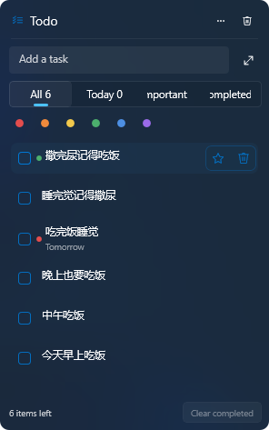 |
| Quick Capture widget | Music widget |
| 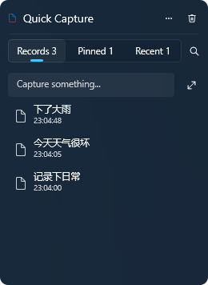 | 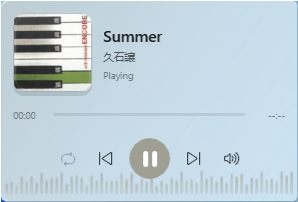 |

### Settings

| General | Appearance |
| --- | --- |
| 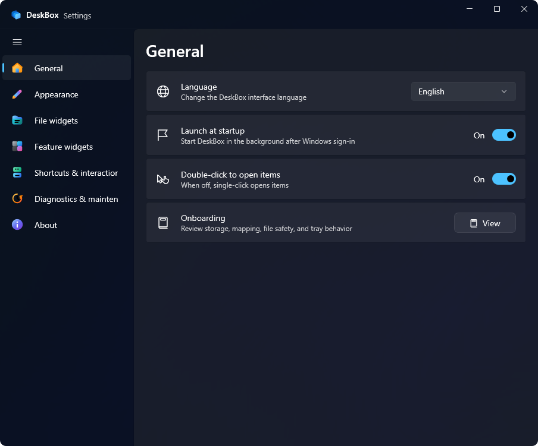 | 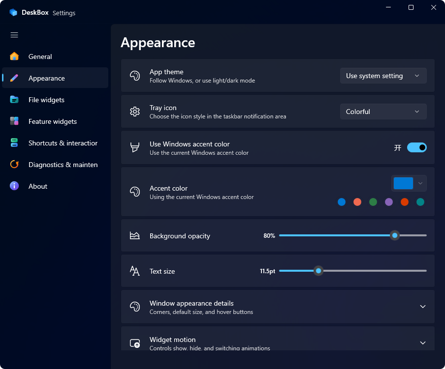 |
| File widgets | Feature widgets |
| 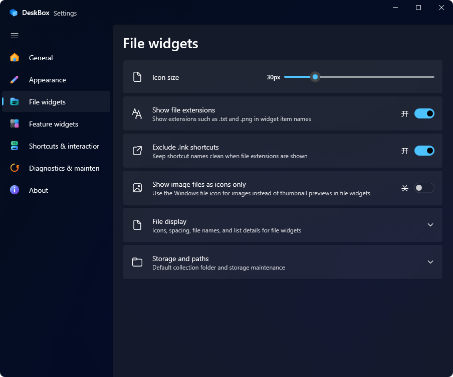 | 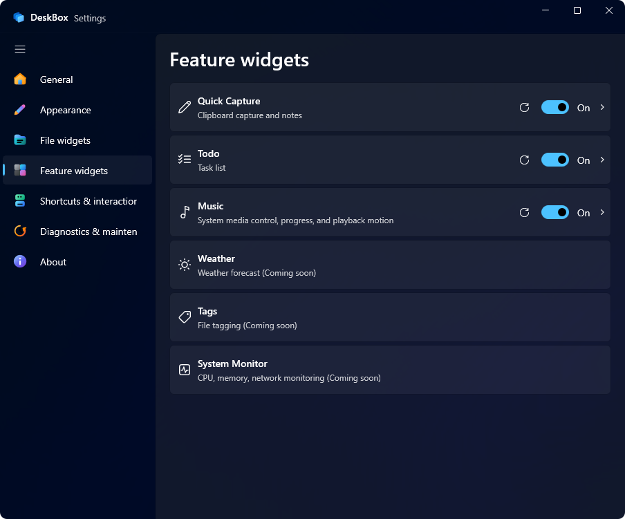 |

### Logo Motion

<p align="center">
  
</p>

## Requirements

- Windows 11.
- .NET 10 Runtime x64.
- Windows App Runtime 2.2 x64.

DeskBox is currently tested on Windows 11. Windows 10 may work in some environments, but it is not a validated target.

For development, install the .NET 10 SDK. Visual Studio with Windows App SDK workload is recommended.

## Install And Uninstall

The installer is built with Inno Setup. It installs DeskBox for the current user by default, lets you change the install folder, and preserves existing app settings, widget configuration, and managed storage content during overwrite installs. Older administrator installs under Program Files are migrated automatically so Explorer drag/drop can keep working normally.

Startup launch is handled silently through the tray. If DeskBox is already running and Windows starts it again at login, the second startup instance exits without opening Settings.

During uninstall, DeskBox stops the running app first and lets you choose whether to remove app-local data under `%LocalAppData%\DeskBox`. Managed storage content is not deleted silently; when cleanup may affect user files, the installer asks before removing anything.

## Build

Restore and build:

```powershell
dotnet restore .\DeskBox.sln -p:Platform=x64
dotnet build .\src\DeskBox\DeskBox.csproj --configuration Debug --no-restore -p:Platform=x64 -v:minimal
```

Run tests:

```powershell
dotnet test .\DeskBox.sln --configuration Debug --no-restore -p:Platform=x64 -v:minimal
```

Launch the Debug app:

```powershell
.\scripts\start-debug.ps1
```

Create a Release x64 publish output and installer:

```powershell
dotnet publish .\src\DeskBox\DeskBox.csproj --configuration Release -p:Platform=x64 -p:RuntimeIdentifier=win-x64 -p:SelfContained=false -p:WindowsAppSDKSelfContained=false -o .\artifacts\publish\DeskBox\x64 -v:minimal
& 'C:\Program Files\Inno Setup 7\ISCC.exe' .\installer\DeskBox.iss
```

Installer output:

```text
Output\DeskBox_Setup_1.3.0_x64.exe
```

## Project Structure

```text
src\DeskBox                 WinUI 3 app source
tests\DeskBox.Tests         core service tests
installer                   Inno Setup scripts
docs\images                 README and release images
docs\motion                 logo motion concepts and SVG assets
docs\releases               GitHub Releases copy
```

## Data Locations

- Settings are stored under `%LocalAppData%\DeskBox\data`.
- The default managed storage root is `%UserProfile%\DeskBox`.
- Generated folders such as `bin`, `obj`, `Output`, `artifacts`, and `TestResults` are ignored by Git.

## Contributing

DeskBox is currently developed and maintained entirely by a solo developer. To ensure architectural consistency and maintain clear copyright for future project paths, I am not accepting external Pull Requests (PRs) at this time.

However, community feedback is crucial to the project's growth! If you encounter any bugs, have feature requests, or want to share UI/UX feedback, please feel free to open an [Issue](https://github.com/Tianyu199509/DeskBox/issues). Thank you for your support and understanding!

## Feedback

DeskBox is still an early public release. If file drag/drop fails on Windows 10/11, try Settings -> Drag-and-drop diagnostics -> Repair first. If the issue remains, please open an [issue](https://github.com/Tianyu199509/DeskBox/issues) with reproduction details, or follow the WeChat public account shown in the app's About page and leave a message there.

## Author

- Developer: Tianyu Zhu
- Repository: <https://github.com/Tianyu199509/DeskBox>

## License

DeskBox is licensed under [GPL-3.0-only](LICENSE).

Earlier DeskBox versions that were already published under the MIT License
remain available under the MIT License. This license change is not retroactive;
see [LICENSE_CHANGE.md](LICENSE_CHANGE.md) for details.
