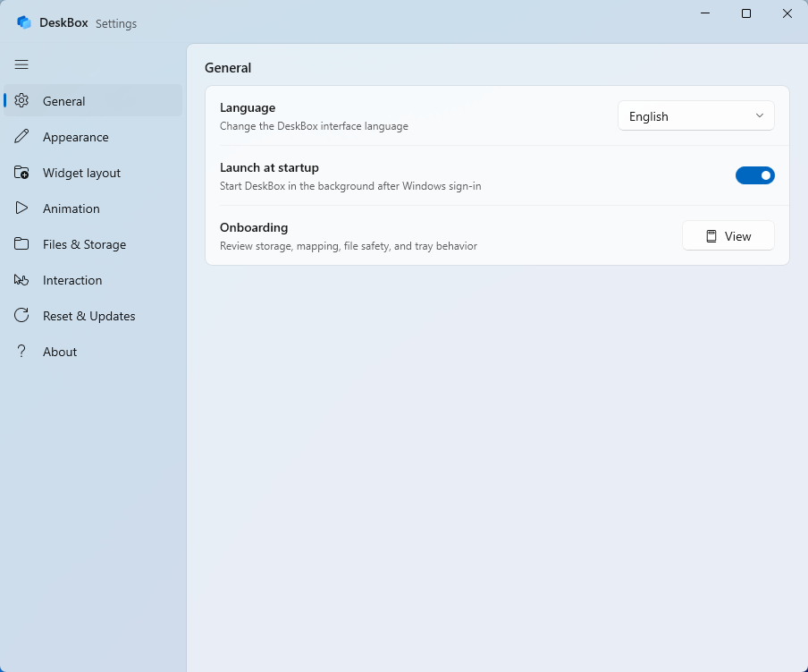
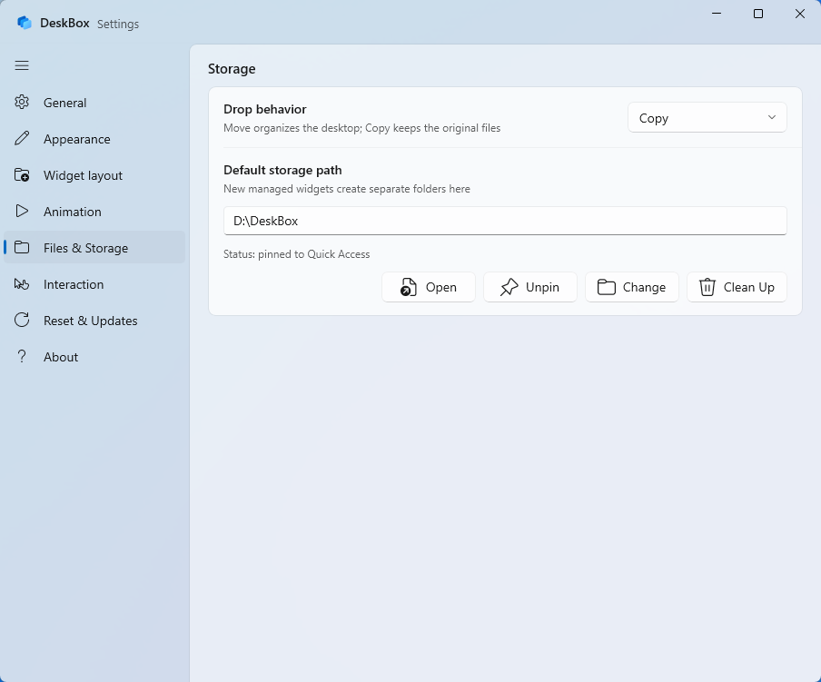

# DeskBox

English | [简体中文](README.zh-CN.md)

[](https://github.com/Tianyu199509/DeskBox/actions/workflows/ci.yml)
[](LICENSE)
[](#requirements)
[](#build)

DeskBox is a lightweight WinUI 3 desktop organizer for Windows 11. It creates native-feeling desktop widgets for collecting files, mapping folders, keeping todos, capturing quick notes, and controlling music from the desktop. It does not replace the Windows desktop shell; it adds one focused layer for keeping everyday things easier to reach, easier to sort, and easier to bring forward when you need them.


## Download

Download the latest installer from [GitHub Releases](https://github.com/Tianyu199509/DeskBox/releases).

Current release: 1.2.0

- [DeskBox_Setup_1.2.0_x64.exe](https://github.com/Tianyu199509/DeskBox/releases/download/v1.2.0/DeskBox_Setup_1.2.0_x64.exe)

The installer checks for .NET 8 Runtime x64 and Windows App Runtime 2.1.3 x64. If either dependency is missing, the setup flow can download and install it for you.

## What's New In 1.2.0

- Rebuilt the widget architecture around shared shell, content host, content factory, registry, session, positioning, diagnostics, and window-factory services.
- Added the feature-widget foundation for Todo, Quick Capture, Music, and future content widgets.
- Added the Todo widget with local task storage, completion state, filters, inline editing, full-screen editing, and custom due times.
- Added the Music widget with Windows media session integration, playback controls, playback mode switching, system volume control, responsive waveform styles, compact layout, and optional album-color ambience.
- Migrated Quick Capture onto the newer widget/content infrastructure and added cached thumbnails for recent image previews.
- Reorganized Settings around the new architecture and expanded automated tests for widget factories, registry/session/positioning, Todo, storage cleanup, and Quick Capture image handling.

See the full [changelog](CHANGELOG.md).

## Why DeskBox Exists

The Windows desktop has been one of the most-used places on the PC for decades, but for many people it also becomes the easiest place to make a mess. DeskBox exists to keep that familiar desktop useful without turning it into something else. Your desktop stays the Windows desktop, and your files stay normal files; DeskBox simply gives you small, tidy places to collect, map, search, edit, and bring things forward.

The project is intentionally built around native Windows behavior. I like the texture and restraint of WinUI, so DeskBox will keep following native Windows patterns wherever practical: WinUI 3 controls, Windows App SDK, DWM corners, acrylic-style surfaces, tray-first behavior, and conservative dependencies. The installer is larger because it carries the WinUI/Windows App SDK world with it, not because DeskBox is trying to become a heavy all-in-one shell.

## Features

- **Managed desktop widgets**: create file collection widgets backed by a real folder.
- **Folder mapping**: display an existing folder as a desktop widget without moving its contents.
- **Todo widget**: keep desktop tasks with quick input, full-screen editing, custom due times, and native-feeling inline controls.
- **Quick Capture**: keep reusable text, links, screenshots, and recent clipboard content in an optional local-only feature widget.
- **Music widget**: control playback, switch playback mode, adjust system volume, and show responsive waveform styles with optional album-color ambience.
- **Move into managed storage**: dropped files are moved into the managed widget's real storage folder by default.
- **Tray controls**: create widgets, map folders, show or hide all widgets, temporarily raise widgets, open managed storage, open Settings, toggle startup launch, and exit.
- **Global hotkey**: enable a keyboard shortcut for quickly showing, hiding, or raising widgets.
- **Native file operations**: drag in, drag out, paste, cut, rename, delete, open, reveal in Explorer, and use keyboard shortcuts.
- **Appearance controls**: tune theme, opacity, DWM corner style, icon size, text size, spacing, filename width, title style, list details, and cover ambience.
- **Storage maintenance**: change the default managed storage root, pin it to Quick Access, clean orphan folders, and confirm actions that may affect user files.

## Screenshots

DeskBox includes both English and Chinese localization. The screenshots below highlight the app's Windows 11-style desktop widgets and Settings.

### Desktop Widgets


### Settings





### Logo Motion

<p align="center">
  
</p>

## Requirements

- Windows 11.
- .NET 8 Runtime x64.
- Windows App Runtime 2.1.3 x64.

DeskBox is currently tested on Windows 11. Windows 10 may work in some environments, but it is not a validated target.

For development, install the .NET 8 SDK. Visual Studio 2022 with Windows App SDK workload is recommended.

## Install And Uninstall

The installer is built with Inno Setup. It installs DeskBox for the current user by default, lets you change the install folder, and preserves existing app settings, widget configuration, and managed storage content during overwrite installs. Older administrator installs under Program Files are migrated automatically so Explorer drag/drop can keep working normally.

Startup launch is handled silently through the tray. If DeskBox is already running and Windows starts it again at login, the second startup instance exits without opening Settings.

During uninstall, DeskBox stops the running app first and lets you choose whether to remove app-local data under `%LocalAppData%\DeskBox`. Managed storage content is not deleted silently; when cleanup may affect user files, the installer asks before removing anything.

## Build

Restore and build:

```powershell
dotnet restore .\DeskBox.sln -p:Platform=x64 -p:RuntimeIdentifier=win-x64
dotnet build .\src\DeskBox\DeskBox.csproj --configuration Debug --no-restore -p:Platform=x64 -p:RuntimeIdentifier=win-x64 -v:minimal
```

Run tests:

```powershell
dotnet test .\DeskBox.sln --configuration Debug --no-restore -p:Platform=x64 -p:RuntimeIdentifier=win-x64 -v:minimal
```

Create a Release x64 publish output and installer:

```powershell
dotnet publish .\src\DeskBox\DeskBox.csproj --configuration Release -p:Platform=x64 -p:RuntimeIdentifier=win-x64 -p:SelfContained=false -p:WindowsAppSDKSelfContained=false -o .\artifacts\publish\DeskBox\x64 -v:minimal
& 'C:\Program Files\Inno Setup 7\ISCC.exe' .\installer\DeskBox.iss
```

Installer output:

```text
Output\DeskBox_Setup_1.2.0_x64.exe
```

## Project Structure

```text
src\DeskBox                 WinUI 3 app source
tests\DeskBox.Tests         core service tests
installer                   Inno Setup scripts
docs\images                 README and release images
docs\motion                 logo motion concepts and SVG assets
docs\releases               GitHub Releases copy
```

## Data Locations

- Settings are stored under `%LocalAppData%\DeskBox\data`.
- The default managed storage root is `%UserProfile%\DeskBox`.
- Generated folders such as `bin`, `obj`, `Output`, `artifacts`, and `TestResults` are ignored by Git.

## Feedback

DeskBox is still an early public release. If file drag/drop fails on Windows 10/11, try Settings -> Drag-and-drop diagnostics -> Repair first. If the issue remains, please open an [issue](https://github.com/Tianyu199509/DeskBox/issues) with reproduction details, or follow the WeChat public account shown in the app's About page and leave a message there.

## Author

- Developer: Tianyu Zhu
- Repository: <https://github.com/Tianyu199509/DeskBox>

## License

DeskBox is licensed under [GPL-3.0-only](LICENSE).

Earlier DeskBox versions that were already published under the MIT License
remain available under the MIT License. This license change is not retroactive;
see [LICENSE_CHANGE.md](LICENSE_CHANGE.md) for details.
