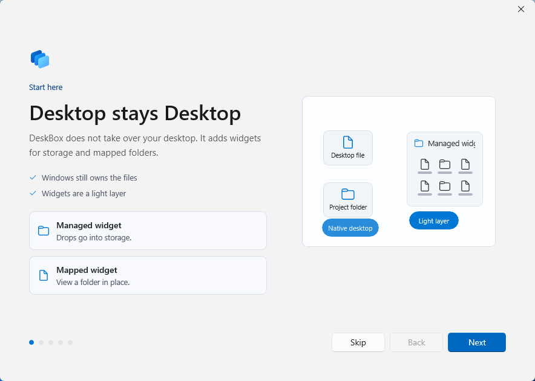

# DeskBox

English | [简体中文](README.zh-CN.md)

[](https://github.com/Tianyu199509/DeskBox/actions/workflows/ci.yml)
[](LICENSE)
[](#requirements)
[](#build)

DeskBox is a lightweight WinUI 3 desktop organizer for Windows 11. It creates native-feeling desktop widgets for collecting files, mapping folders, and bringing those groups forward from the tray or a global hotkey. It does not replace the Windows desktop shell; it adds one focused layer for keeping files easier to reach and easier to clean up.


## Download

Download the latest installer from [GitHub Releases](https://github.com/Tianyu199509/DeskBox/releases).

Current release: 1.1.1

- [DeskBox_Setup_1.1.1_x64.exe](https://github.com/Tianyu199509/DeskBox/releases/download/v1.1.1/DeskBox_Setup_1.1.1_x64.exe)

The installer checks for .NET 8 Runtime x64 and Windows App Runtime 2.1.3 x64. If either dependency is missing, the setup flow can download and install it for you.

## What's New In 1.1.1

- Fixed internal dragging for shortcut files (`.lnk`) in managed widgets.

## What's New In 1.1.0

- Added drag-and-drop diagnostics and one-click repair in Settings. If Windows 10/11 cannot drag files into widgets, open Settings and run the repair first.
- Improved Explorer drag/drop fallback handling for managed and mapped widgets, including better diagnostics for blocked or unusual shell formats.
- Fixed widget sorting stability with natural name ordering and consistent insertion after new files are added.
- Improved Quick Capture text behavior: double-click opens the inline editor for saved text, and the context menu can edit text in Notepad.
- Changed the default tray icon style to colorful for new installs and restored defaults.
- Improved first-run onboarding so it appears only after the first install launch, while remaining available from Settings.
- Improved uninstall behavior with an optional prompt to remove or keep local DeskBox app data.

See the full [changelog](CHANGELOG.md). GitHub Release copy is available in [docs/releases/v1.1.1.md](docs/releases/v1.1.1.md).

## Why DeskBox Exists

Many desktop organization tools take over the desktop: they replace familiar interactions, rebuild file entry points, or become a second desktop shell. DeskBox takes a narrower approach. The Windows desktop stays the Windows desktop, and your files stay normal files. DeskBox only adds a clean layer for moving, copying, grouping, and viewing those files.

The product is intentionally built around native Windows behavior. Widgets use WinUI 3, Windows App SDK, DWM corners, acrylic-style surfaces, and a tray-first workflow so the app feels like it belongs on Windows 11 instead of sitting on top of it.

## Features

- **Managed desktop widgets**: create file collection widgets backed by a real folder.
- **Folder mapping**: display an existing folder as a desktop widget without moving its contents.
- **Quick Capture**: keep reusable text, links, screenshots, and recent clipboard content in an optional local-only feature widget.
- **Move or copy on drop**: choose whether managed widgets organize by moving files or by keeping originals and adding copies.
- **Tray controls**: create widgets, map folders, show or hide all widgets, temporarily raise widgets, open managed storage, open Settings, toggle startup launch, and exit.
- **Global hotkey**: enable a keyboard shortcut for quickly showing, hiding, or raising widgets.
- **Native file operations**: drag in, drag out, paste, cut, rename, delete, open, reveal in Explorer, and use keyboard shortcuts.
- **Appearance controls**: tune theme, opacity, DWM corner style, icon size, text size, spacing, filename width, and list details.
- **Storage maintenance**: change the default managed storage root, pin it to Quick Access, clean orphan folders, and confirm actions that may affect user files.
- **First-run onboarding**: learn the core concepts and configure important defaults before using the app, then replay onboarding from Settings when needed.

## Screenshots

DeskBox includes both English and Chinese localization. The screenshots below highlight the app's Windows 11-style desktop widgets, Settings, and onboarding flow.

### Desktop Widgets


### Settings


### Onboarding



### Logo Motion

<p align="center">
  
</p>

## Requirements

- Windows 11.
- .NET 8 Runtime x64.
- Windows App Runtime 2.1.3 x64.

DeskBox is currently tested on Windows 11. Windows 10 may work in some environments, but it is not a validated target.

For development, install the .NET 8 SDK. Visual Studio 2022 with Windows App SDK workload is recommended.

## Install And Uninstall

The installer is built with Inno Setup. It installs DeskBox for the current user by default, lets you change the install folder, and preserves existing app settings, widget configuration, and managed storage content during overwrite installs. Older administrator installs under Program Files are migrated automatically so Explorer drag/drop can keep working normally.

Startup launch is handled silently through the tray. If DeskBox is already running and Windows starts it again at login, the second startup instance exits without opening Settings.

During uninstall, DeskBox stops the running app first and lets you choose whether to remove app-local data under `%LocalAppData%\DeskBox`. Managed storage content is not deleted silently; when cleanup may affect user files, the installer asks before removing anything.

## Build

Restore and build:

```powershell
dotnet restore .\DeskBox.sln -p:Platform=x64 -p:RuntimeIdentifier=win-x64
dotnet build .\src\DeskBox\DeskBox.csproj --configuration Debug --no-restore -p:Platform=x64 -p:RuntimeIdentifier=win-x64 -v:minimal
```

Run tests:

```powershell
dotnet test .\DeskBox.sln --configuration Debug --no-restore -p:Platform=x64 -p:RuntimeIdentifier=win-x64 -v:minimal
```

Create a Release x64 publish output and installer:

```powershell
dotnet publish .\src\DeskBox\DeskBox.csproj --configuration Release -p:Platform=x64 -p:RuntimeIdentifier=win-x64 -p:SelfContained=false -p:WindowsAppSDKSelfContained=false -o .\artifacts\publish\DeskBox\x64 -v:minimal
& 'C:\Program Files\Inno Setup 7\ISCC.exe' .\installer\DeskBox.iss
```

Installer output:

```text
Output\DeskBox_Setup_1.1.1_x64.exe
```

## Project Structure

```text
src\DeskBox                 WinUI 3 app source
tests\DeskBox.Tests         core service tests
installer                   Inno Setup scripts
docs\images                 README and release images
docs\motion                 logo motion concepts and SVG assets
docs\releases               GitHub Releases copy
```

## Data Locations

- Settings are stored under `%LocalAppData%\DeskBox\data`.
- The default managed storage root is `%UserProfile%\DeskBox`.
- Generated folders such as `bin`, `obj`, `Output`, `artifacts`, and `TestResults` are ignored by Git.

## Feedback

DeskBox is still an early public release. If file drag/drop fails on Windows 10/11, try Settings -> Drag-and-drop diagnostics -> Repair first. If the issue remains, please open an [issue](https://github.com/Tianyu199509/DeskBox/issues) with reproduction details, or follow the WeChat public account shown in the app's About page and leave a message there.

## Author

- Developer: Tianyu Zhu
- Repository: <https://github.com/Tianyu199509/DeskBox>

## License

DeskBox is released under the [MIT License](LICENSE).
