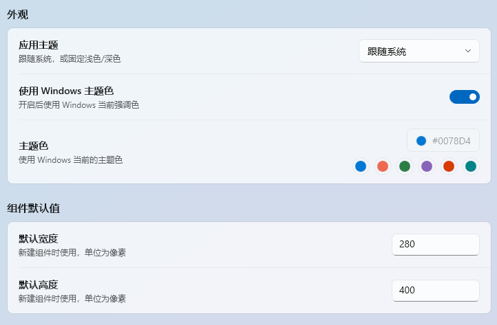
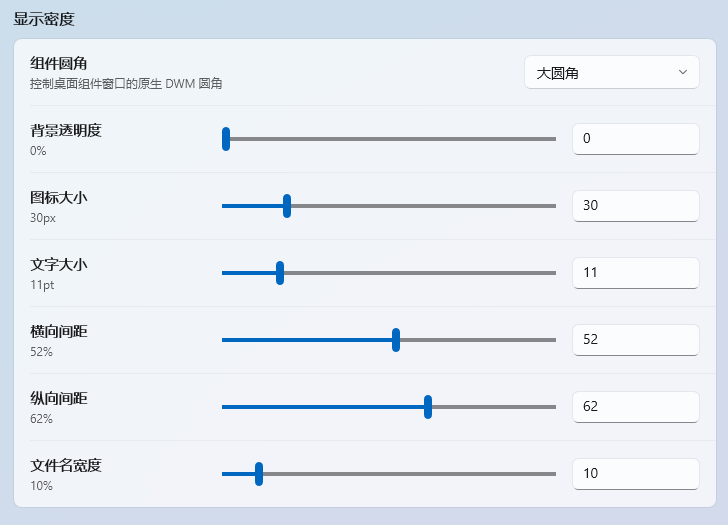
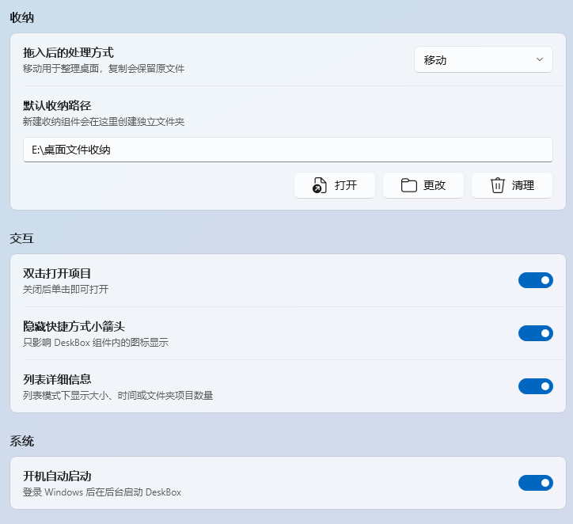

# DeskBox

[](https://github.com/Tianyu199509/DeskBox/actions/workflows/ci.yml)
[](LICENSE)
[](#环境要求)
[](#构建)

DeskBox 是一个基于 WinUI 3 的 Windows 桌面整理工具。它可以创建轻量桌面组件，用于收纳文件、映射文件夹，并通过系统托盘快速管理组件。

## 下载

可以在 [Releases](https://github.com/Tianyu199509/DeskBox/releases) 下载最新版安装包。

当前公开测试版本：

- [DeskBox_Setup_1.0.0_x64.exe](https://github.com/Tianyu199509/DeskBox/releases/download/v1.0.0/DeskBox_Setup_1.0.0_x64.exe)

安装器会按需检测并下载 .NET 8 Runtime x64 和 Windows App Runtime 2.1 x64。离线环境可先手动安装这两个运行时后再运行安装器。

## 项目截图

### 浅色模式


### 暗色模式


### 外观设置



### 显示密度



### 收纳交互



## 为什么做这个产品

很多传统桌面管理工具会接管桌面：替换原来的桌面交互、重建一套文件入口，甚至让桌面变成另一个完整的管理容器。我不太想走这条路。DeskBox 的目标是尽可能保留 Windows 原生桌面的质感和行为，只在文件整理这件事上补一层更轻的自动化能力。

所以 DeskBox 选择了“移动式整理”的思路：桌面仍然是桌面，文件仍然是普通文件，组件只是帮助你把文件移动、复制或映射到合适的位置。它不会试图成为一个新的桌面 Shell，也不会强迫你改变 Windows 原本的使用方式。

界面层面我比较重视 WinUI 3 的设计一致性。项目中的设置页、桌面组件、对话交互和窗口质感都尽量围绕 Windows App SDK、WinUI 3、Mica、DWM 圆角等原生能力构建，目标是让它看起来像一个 Windows 应用，而不是套了一层桌面皮肤的网页工具。

## 功能

- 新建组件：创建用于收纳文件的桌面组件，支持拖入、拖出、复制、剪切、删除、重命名等常用文件操作。
- 新建文件夹映射：将已有文件夹映射为桌面组件，直接展示文件夹内容，不改变原文件位置。
- 原生窗口质感：尽量使用 WinUI 3、Windows App SDK、Mica、DWM 圆角和系统托盘能力。
- 组件外观调节：支持主题、透明度、圆角、图标大小、字号、显示密度和列表详情开关。
- 系统托盘管理：支持新建组件、显示/隐藏组件、打开设置、开机启动和退出。
- 文件安全提示：删除组件、清理收纳目录、卸载应用时尽量明确提示用户文件所在位置和影响范围。

## 环境要求

- Windows 11。
- .NET 8 Runtime x64。
- Windows App Runtime 2.1 x64。

目前项目只在 Windows 11 下测试过。Windows 10 或其他系统版本没有做完整验证，如果遇到兼容性问题，欢迎提交 Issue 或反馈复现路径。

开发环境需要 .NET 8 SDK。推荐使用安装了 Windows App SDK 工作负载的 Visual Studio 2022。

## 安装和卸载

安装器基于 Inno Setup 构建，安装时会检测运行时依赖。若目标电脑缺少 .NET 8 Runtime 或 Windows App Runtime，安装过程会显示运行环境准备页，并联网下载、静默安装缺失依赖。

卸载时安装器会先停止正在运行的 DeskBox 进程。如果检测到默认收纳目录中仍有文件或文件夹，会在卸载前提示用户确认；卸载过程不会删除用户移动到收纳目录中的内容。

## 构建

```powershell
dotnet restore .\DeskBox.sln -p:Platform=x64 -p:RuntimeIdentifier=win-x64
dotnet build .\src\DeskBox\DeskBox.csproj --configuration Debug --no-restore -p:Platform=x64 -p:RuntimeIdentifier=win-x64 -v:minimal
```

应用输出目录：

```text
src\DeskBox\bin\x64\Debug\net8.0-windows10.0.22621.0\win-x64
```

构建 Release x64 输出并生成安装包：

```powershell
dotnet publish .\src\DeskBox\DeskBox.csproj --configuration Release -p:Platform=x64 -p:RuntimeIdentifier=win-x64 -p:SelfContained=false -p:WindowsAppSDKSelfContained=false -o .\artifacts\publish\DeskBox\x64 -v:minimal
& 'C:\Program Files\Inno Setup 7\ISCC.exe' .\installer\DeskBox.iss
```

安装脚本读取目录：

```text
artifacts\publish\DeskBox\x64
```

## 测试

```powershell
dotnet test .\DeskBox.sln --configuration Debug --no-restore -p:Platform=x64 -p:RuntimeIdentifier=win-x64 -v:minimal
```

当前测试项目覆盖了核心文件转移、路径处理和收纳历史行为。删除、清理收纳目录这类涉及真实文件移动的逻辑，后续仍建议继续补充更多回归测试。

## 项目结构

```text
src\DeskBox                 WinUI 3 应用源码
tests\DeskBox.Tests         核心服务测试
installer                   Inno Setup 安装脚本
docs\images                 README 截图资源
```

## 数据位置

- 应用设置保存在 `%LocalAppData%\DeskBox\data`。
- 默认收纳路径为 `%UserProfile%\DeskBox`。
- `bin`、`obj`、`Output`、`artifacts` 和 `TestResults` 等生成目录已被 Git 忽略。

## 反馈

这个项目目前仍处于早期公开版本。如果你遇到文件拖拽、系统运行时、窗口层级、卸载残留或不同 Windows 版本兼容性问题，欢迎通过 [Issues](https://github.com/Tianyu199509/DeskBox/issues) 提供复现路径。

## 开发者

- 开发者：朱天雨
- 开源仓库：<https://github.com/Tianyu199509/DeskBox>

## 开源协议

本项目使用 MIT 协议开源，详见 [LICENSE](LICENSE)。
