# DeskBox

简体中文 | [English](README.md)

[](https://github.com/Tianyu199509/DeskBox/actions/workflows/ci.yml)
[](LICENSE)
[](#环境要求)
[](#构建)

DeskBox 是一个基于 WinUI 3 的 Windows 11 桌面整理工具。它用轻量桌面格子帮你收纳文件、映射文件夹、记录待办、随手记点东西，也可以在桌面上控制音乐。DeskBox 不会替换 Windows 桌面，只是在原生桌面之上补一层更好整理、更好访问、更容易临时唤起的能力。

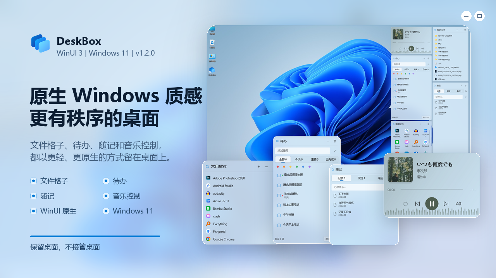

## 下载

可以在 [GitHub Releases](https://github.com/Tianyu199509/DeskBox/releases) 下载最新版安装包。

当前版本：1.3.0

- [DeskBox_Setup_1.3.0_x64.exe](https://github.com/Tianyu199509/DeskBox/releases/download/v1.3.0/DeskBox_Setup_1.3.0_x64.exe)

安装器会检测 .NET 10 Runtime x64 和 Windows App Runtime 2.2 x64。若目标电脑缺少运行时依赖，安装流程可以联网下载并安装。

## 最新更新

- **胶囊模式**：格子可收起为包含关键信息的紧凑形态，通过点击或仅标题区域悬停展开。可选择关键信息、简要摘要、仅图标和标题以及隐私保护，胶囊与展开宽度可保持一致或独立调整。
- **灵活的胶囊排列**：胶囊可自由摆放，也可组成能够整体移动和排序的组合栏，支持悬浮/贴边、自动方向与间距。基于屏幕边界的锚点让展开和收起始终与胶囊位置保持关联。
- **文件自动叠放**：不移动真实文件，按类型或日期自动整理文件格子，也可创建带优先级、实时预览、形成数量、内部排序和未匹配策略的自定义扩展名规则。
- **待办与随记附件**：一条内容可关联多个文件，支持关联原文件或复制到 DeskBox；复制正文时附带本地化附件路径。标签页显示、拖到标签页操作、预览行数和 Enter 键行为均可配置。
- **外观与音乐控制**：新增云母 Alt、标准亚克力、材质浓度、边框颜色模式和显示密度预设。音乐可以自动适应尺寸，也可强制使用封面或控制布局。
- **Windows 风格设置**：全局搜索移入标题栏，拥挤页面拆为聚焦的详细页面，重要选项直接放在入口卡片，高级设置更容易找到但不会挤满首页。
- **数据安全**：支持带完整性校验的备份导出与恢复、自动快照、弹性 JSON 恢复，以及待办/随记附件健康检查。
- **交互稳定性**：优化胶囊与叠放动画、拖入临时展开、标题栏操作、调整大小参考线、窗口层级、托盘显示/隐藏、多显示器位置恢复和快速连续操作。

完整更新记录见 [CHANGELOG.md](CHANGELOG.md)。

## 为什么做这个产品

Windows 桌面已经陪大家用了很多年，也是很多人每天最常用的地方。但它也很容易变乱：临时文件、截图、下载内容、待处理事项，最后都堆在一起。DeskBox 想做的是帮桌面多一层克制的整理能力，而不是把桌面变成另一个复杂系统。Windows 桌面仍然是 Windows 桌面，文件仍然是普通文件，格子只是帮你把它们收纳、映射、查看和临时唤起。

我也很喜欢 WinUI 的原生质感，所以 DeskBox 后续会一直尽量按 Windows 原生设计和交互规范做下去：WinUI 3 控件、Windows App SDK、DWM 圆角、亚克力质感、托盘优先的工作流。能用原生能力时会优先用原生能力，不会为了一个很小的效果随便引入很重的第三方库。安装包采用框架依赖方式，会检查目标电脑上的 .NET 与 Windows App Runtime，只在缺失时下载对应依赖。

## 功能

- **收纳格子**：创建真实文件夹支撑的桌面格子，用于整理文件。
- **文件夹映射**：把已有文件夹展示为桌面格子，不改变原文件位置。
- **待办格子**：支持截止日期、提醒、重复、颜色标记、多附件、可配置视图和批量操作。
- **随记**：保存常用文本、链接、图片和文件，支持固定、纸张样式、多附件和专注详情编辑。
- **音乐格子**：支持播放控制、播放模式切换、系统音量调整和自适应封面布局，可跟随封面氛围取色。
- **胶囊模式**：把格子收起为智能摘要，可独立摆放，也可组合成能够排序和整体移动的桌面栏。
- **文件自动叠放**：按类型、日期或自定义扩展名规则整理文件格子，不移动真实文件。
- **拖入后收纳**：拖入收纳格子的文件默认复制到对应的真实收纳文件夹，也可在设置中改为移动。
- **托盘管理**：新建格子、映射文件夹、显示或隐藏全部格子、临时置顶、打开收纳目录、打开设置、开机自启和退出。
- **全局快捷键**：可用快捷键快速显示、隐藏或唤起格子。
- **原生文件操作**：拖入、拖出、粘贴、剪切、重命名、删除、打开、在资源管理器中显示、键盘快捷键，并可通过已运行的 QuickLook 按空格预览。
- **外观调节**：支持原生材质、材质浓度、透明度、边框颜色与样式、DWM 圆角、显示密度、图标/文字大小、标题样式和封面氛围背景。
- **数据与收纳维护**：导出或恢复备份、管理自动快照、检查附件健康、调整默认收纳路径、固定到快速访问并恢复孤立收纳文件夹。

## 截图

### 桌面总览

| 浅色主题 | 深色主题 |
| --- | --- |
| 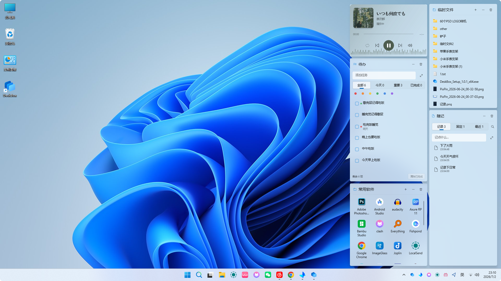 | 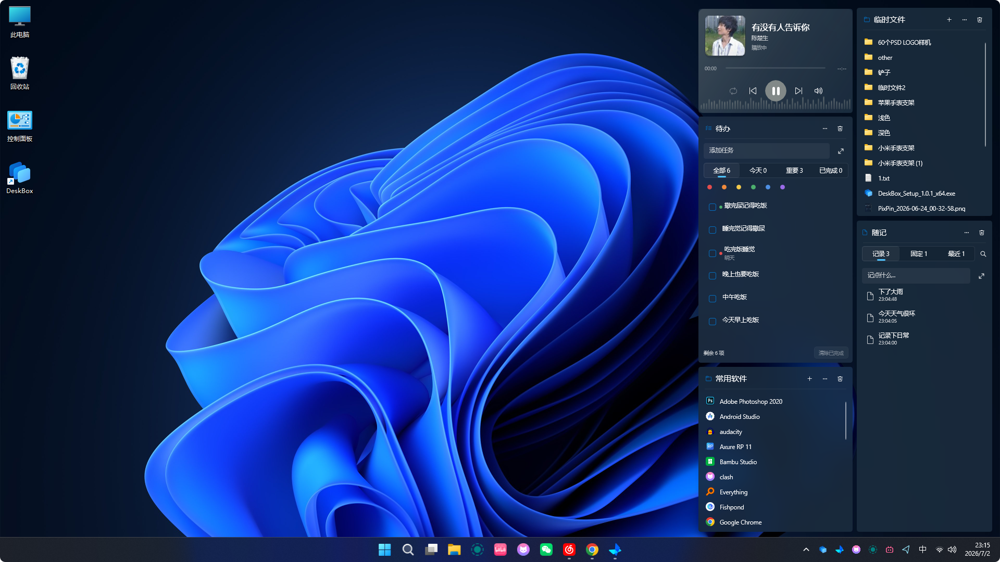 |

### 核心格子

| 文件格子 | 待办格子 |
| --- | --- |
| 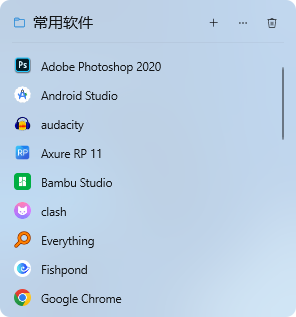 | 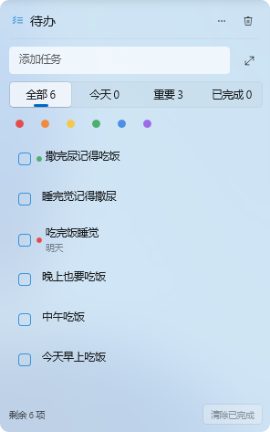 |
| 随记格子 | 音乐格子 |
| 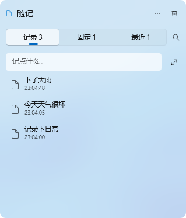 | 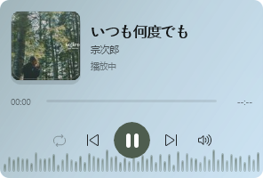 |

### 设置页

| 常规 | 外观 |
| --- | --- |
| 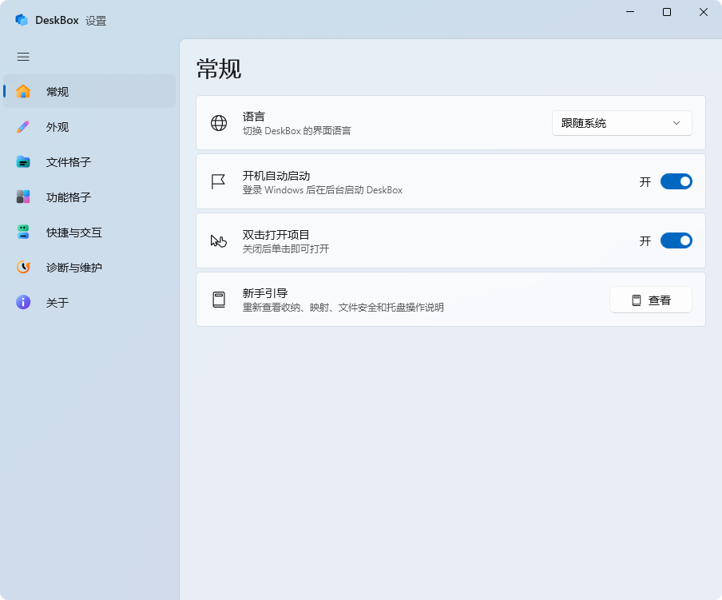 | 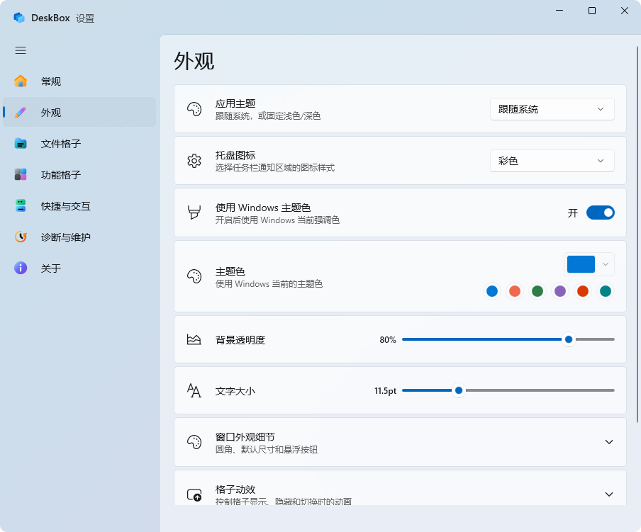 |
| 文件格子 | 功能格子 |
| 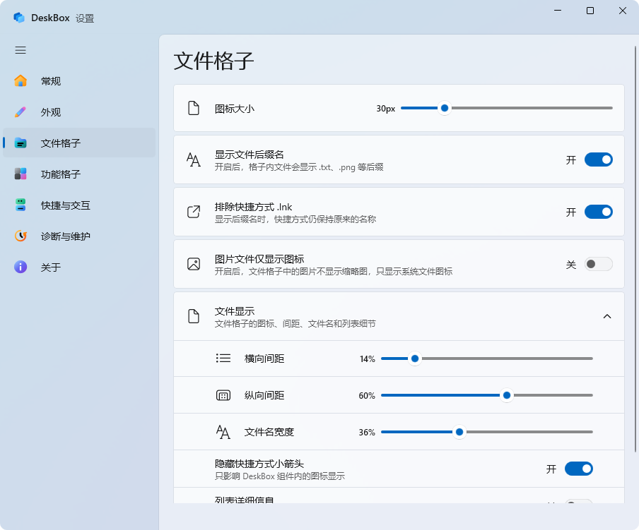 | 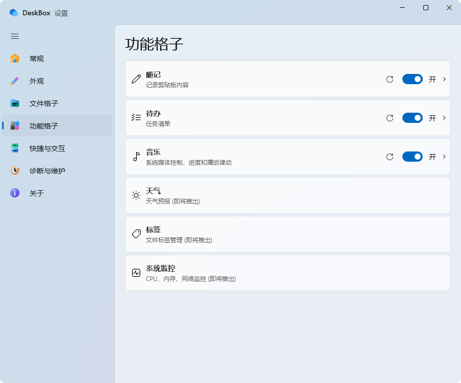 |

### 品牌动效

<p align="center">
  
</p>

## 环境要求

- Windows 11。
- .NET 10 Runtime x64。
- Windows App Runtime 2.2 x64。

当前项目主要在 Windows 11 下测试。Windows 10 或其他系统版本尚未完整验证。

开发环境需要 .NET 10 SDK。推荐使用安装了 Windows App SDK 工作负载的 Visual Studio。

## 安装和卸载

安装器基于 Inno Setup 构建，默认安装到当前用户目录。覆盖安装会保留现有应用设置、格子配置和收纳目录内容；旧版如果安装在 Program Files，安装器会自动迁移，避免 DeskBox 以管理员权限运行后影响资源管理器拖拽。

开机自启会静默启动到托盘。如果 DeskBox 已经运行，登录时再次启动的实例会直接退出，不会弹出设置页面。

卸载时安装器会先停止正在运行的 DeskBox，并让你选择是否删除 `%LocalAppData%\DeskBox` 下的本地应用数据。收纳目录中的用户文件不会被静默删除；当清理可能影响用户文件时，会先提示确认。

## 构建

还原并构建：

```powershell
dotnet restore .\DeskBox.sln -p:Platform=x64
dotnet build .\src\DeskBox\DeskBox.csproj --configuration Debug --no-restore -p:Platform=x64 -v:minimal
```

运行测试：

```powershell
dotnet test .\DeskBox.sln --configuration Debug --no-restore -p:Platform=x64 -v:minimal
```

启动 Debug 应用：

```powershell
.\scripts\start-debug.ps1
```

生成 Release x64 输出和安装包：

```powershell
dotnet publish .\src\DeskBox\DeskBox.csproj --configuration Release -p:Platform=x64 -p:RuntimeIdentifier=win-x64 -p:SelfContained=false -p:WindowsAppSDKSelfContained=false -o .\artifacts\publish\DeskBox\x64 -v:minimal
& 'C:\Program Files\Inno Setup 7\ISCC.exe' .\installer\DeskBox.iss
```

安装包输出：

```text
Output\DeskBox_Setup_1.3.0_x64.exe
```

## 项目结构

```text
src\DeskBox                 WinUI 3 应用源码
tests\DeskBox.Tests         核心服务测试
installer                   Inno Setup 安装脚本
docs\images                 README 和发布截图资源
docs\motion                 品牌动效方案与 SVG 资源
docs\releases               GitHub Releases 发布文案
```

## 数据位置

- 应用设置保存在 `%LocalAppData%\DeskBox\data`。
- 默认收纳路径为 `%UserProfile%\DeskBox`。
- `bin`、`obj`、`Output`、`artifacts` 和 `TestResults` 等生成目录已被 Git 忽略。

## 贡献与反馈

本项目目前由个人开发者独立维护，并作为长期的个人产品进行演进。为了保证代码架构的绝对一致性以及后续版权的清晰度，本项目当前暂不接受外部的代码合并（Pull Request）。

尽管如此，DeskBox 的成长离不开社区的反馈！如果您在使用中遇到了 Bug，或者对新功能有绝佳的想法，非常欢迎您通过提交 [Issue](https://github.com/Tianyu199509/DeskBox/issues) 的方式与我交流。感谢您的理解与支持！

## 反馈

DeskBox 仍处于早期公开版本。如果 Win10/Win11 遇到文件拖不进格子的问题，请先尝试"设置 -> 拖拽异常诊断 -> 一键修复"。如果仍有问题，可以扫码关注应用"关于"页里的公众号留言，或在 GitHub 提交 [Issue](https://github.com/Tianyu199509/DeskBox/issues)。

## 作者

- 开发者：Tianyu Zhu
- 开源仓库：<https://github.com/Tianyu199509/DeskBox>

## 开源协议

DeskBox 现在使用 [GPL-3.0-only](LICENSE) 授权。

此前已经以 MIT License 发布的 DeskBox 旧版本，仍然按 MIT License 授权。本次协议变更不追溯旧版本；详情见 [LICENSE_CHANGE.md](LICENSE_CHANGE.md)。
