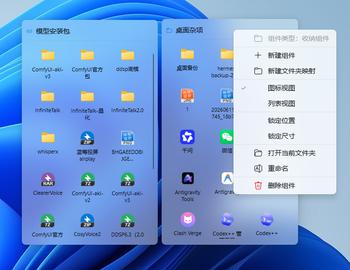
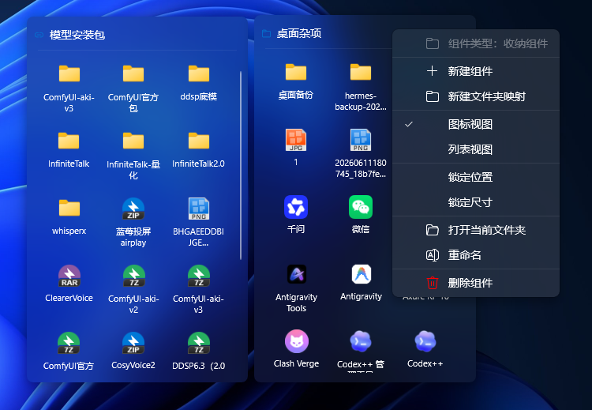
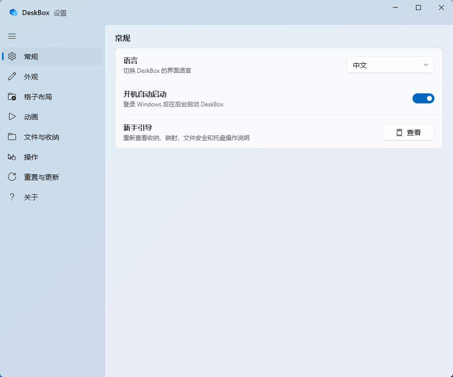
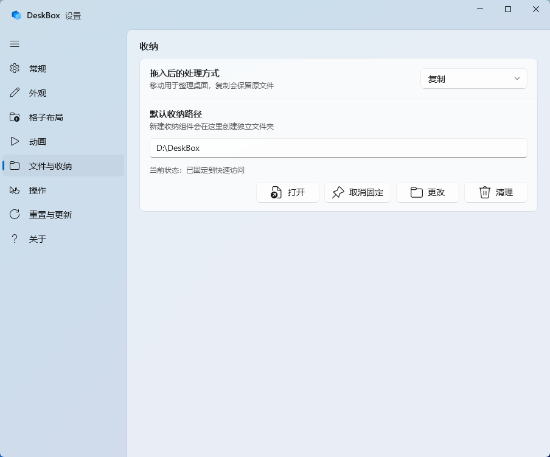
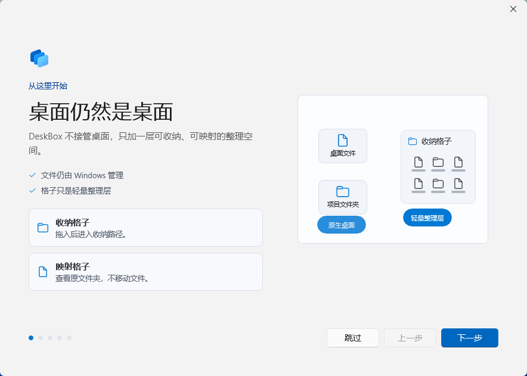

# DeskBox

简体中文 | [English](README.md)

[](https://github.com/Tianyu199509/DeskBox/actions/workflows/ci.yml)
[](LICENSE)
[](#环境要求)
[](#构建)

DeskBox 是一个基于 WinUI 3 的 Windows 11 桌面整理工具。它用轻量桌面格子帮你收纳文件、映射文件夹，并通过托盘或全局快捷键快速显示、隐藏、临时置顶这些格子。它不会替换 Windows 桌面，只是在原生桌面之上补一层更好整理的能力。


## 下载

可以在 [GitHub Releases](https://github.com/Tianyu199509/DeskBox/releases) 下载最新版安装包。

当前版本：1.0.6

- [DeskBox_Setup_1.0.6_x64.exe](https://github.com/Tianyu199509/DeskBox/releases/download/v1.0.6/DeskBox_Setup_1.0.6_x64.exe)

安装器会检测 .NET 8 Runtime x64 和 Windows App Runtime 2.1.3 x64。若目标电脑缺少运行时依赖，安装流程可以联网下载并安装。

## 1.0.6 更新

- 新增随记功能格子：可本地保存文本、链接、截图和最近复制内容，功能可关闭。
- 优化随记使用流程：记录、固定、最近三个视图，支持悬停操作、当前视图搜索、拖出内容和保存到文件格子。
- 优化上传友好入口：补充收纳路径入口、快速访问固定、映射文件夹快捷方式和托盘打开收纳目录。
- 优化拖拽与剪贴板行为：文件拖拽优先保持文件格式，文本单独处理，并避免 DeskBox 自己写入剪贴板的内容污染最近记录。
- 优化窗口层级、格子刷新、新手引导缩放、自定义图标、文件后缀显示、迁移反馈和随记小窗口弹窗布局。

完整更新记录见 [CHANGELOG.md](CHANGELOG.md)。GitHub Release 可使用 [docs/releases/v1.0.6.md](docs/releases/v1.0.6.md) 中的中英文发布文案。

## 为什么做这个产品

很多桌面整理工具会接管桌面：替换原本的交互，重建一套文件入口，甚至让桌面变成另一个完整的管理容器。DeskBox 不想走这条路。它的目标是保留 Windows 原生桌面，只在文件整理这件事上补一层更轻的能力。

所以 DeskBox 选择了“移动式整理”的思路：桌面仍然是桌面，文件仍然是普通文件，格子只是帮你把文件移动、复制或映射到合适的位置。它不会试图成为新的桌面 Shell，也不会强迫你改变 Windows 原本的使用方式。

## 功能

- **收纳组件**：创建真实文件夹支撑的桌面格子，用于整理文件。
- **文件夹映射**：把已有文件夹展示为桌面格子，不改变原文件位置。
- **随记**：用可选的本地功能格子保存常用文本、链接、截图和最近复制内容。
- **拖入后移动或复制**：可设置拖入收纳组件后的默认处理方式。
- **托盘管理**：新建组件、映射文件夹、显示或隐藏全部组件、临时置顶、打开收纳目录、打开设置、开机自启和退出。
- **全局快捷键**：在设置中开启后，可用快捷键快速显示、隐藏或唤起格子。
- **原生文件操作**：拖入、拖出、粘贴、剪切、重命名、删除、打开、在资源管理器中显示和键盘快捷键。
- **外观调节**：支持主题、透明度、DWM 圆角、图标大小、文字大小、间距、文件名宽度和列表详情。
- **收纳目录维护**：支持默认收纳路径调整、快速访问固定、孤立目录清理和安全确认。
- **新用户引导**：首次启动时解释核心概念并配置关键默认项，也可以在设置中重新打开。

## 截图

### 桌面格子





### 设置





### 新用户引导



### 品牌动效

<p align="center">
  
</p>

## 环境要求

- Windows 11。
- .NET 8 Runtime x64。
- Windows App Runtime 2.1.3 x64。

当前项目主要在 Windows 11 下测试。Windows 10 或其他系统版本尚未完整验证。

开发环境需要 .NET 8 SDK。推荐使用安装了 Windows App SDK 工作负载的 Visual Studio 2022。

## 安装和卸载

安装器基于 Inno Setup 构建。覆盖安装会保留现有应用设置、组件配置和收纳目录内容。

开机自启会静默启动到托盘。如果 DeskBox 已经运行，登录时再次启动的实例会直接退出，不会弹出设置页。

卸载时安装器会先停止正在运行的 DeskBox。收纳目录中的用户文件不会被静默删除；当清理可能影响用户文件时，会先提示确认。

## 构建

还原并构建：

```powershell
dotnet restore .\DeskBox.sln -p:Platform=x64 -p:RuntimeIdentifier=win-x64
dotnet build .\src\DeskBox\DeskBox.csproj --configuration Debug --no-restore -p:Platform=x64 -p:RuntimeIdentifier=win-x64 -v:minimal
```

运行测试：

```powershell
dotnet test .\DeskBox.sln --configuration Debug --no-restore -p:Platform=x64 -p:RuntimeIdentifier=win-x64 -v:minimal
```

生成 Release x64 输出和安装包：

```powershell
dotnet publish .\src\DeskBox\DeskBox.csproj --configuration Release -p:Platform=x64 -p:RuntimeIdentifier=win-x64 -p:SelfContained=false -p:WindowsAppSDKSelfContained=false -o .\artifacts\publish\DeskBox\x64 -v:minimal
& 'C:\Program Files\Inno Setup 7\ISCC.exe' .\installer\DeskBox.iss
```

安装包输出：

```text
Output\DeskBox_Setup_1.0.6_x64.exe
```

## 项目结构

```text
src\DeskBox                 WinUI 3 应用源码
tests\DeskBox.Tests         核心服务测试
installer                   Inno Setup 安装脚本
docs\images                 README 和发布截图资源
docs\motion                 品牌动效方案与 SVG 资源
docs\releases               GitHub Releases 发布文案
```

## 数据位置

- 应用设置保存于 `%LocalAppData%\DeskBox\data`。
- 默认收纳路径为 `%UserProfile%\DeskBox`。
- `bin`、`obj`、`Output`、`artifacts` 和 `TestResults` 等生成目录已被 Git 忽略。

## 反馈

DeskBox 仍处于早期公开版本。如果你遇到文件拖拽、运行时依赖、窗口层级、卸载残留或不同 Windows 版本兼容性问题，欢迎通过 [Issues](https://github.com/Tianyu199509/DeskBox/issues) 提供复现路径。

## 作者

- 开发者：朱天雨
- 开源仓库：<https://github.com/Tianyu199509/DeskBox>

## 开源协议

本项目使用 [MIT License](LICENSE) 开源。
